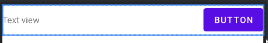
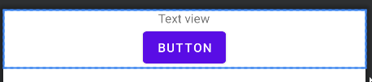
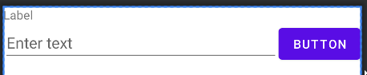
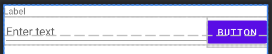
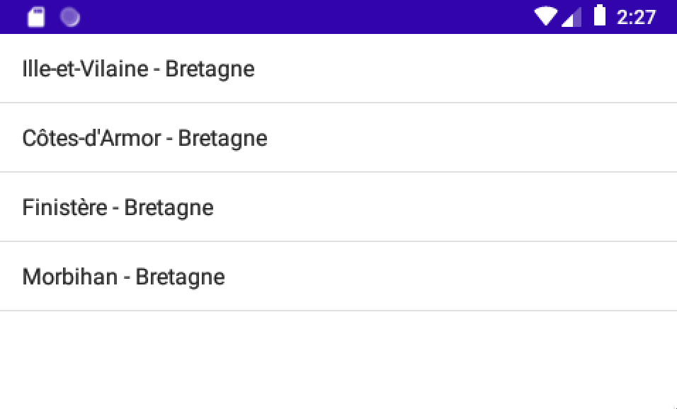
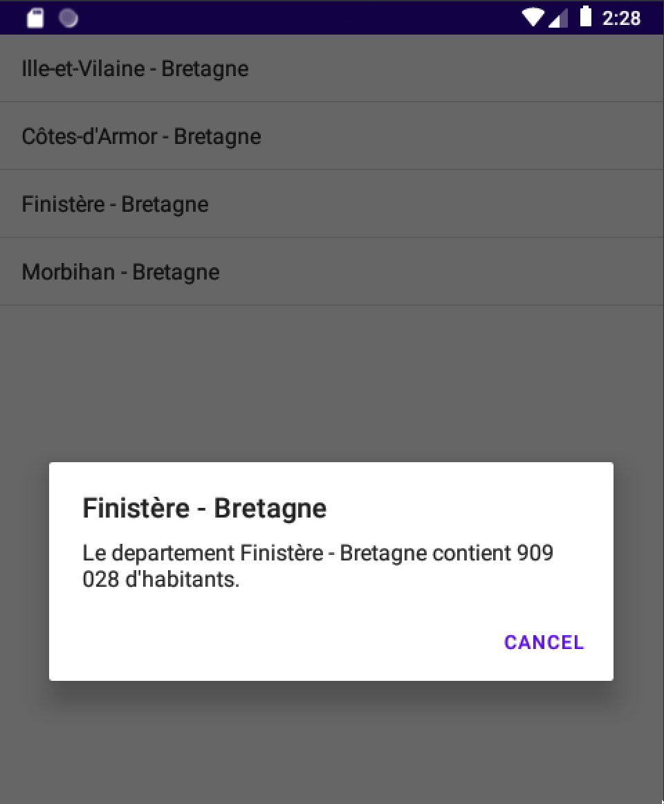

# TP2 sur le développement de layout Android
## Introduction
Il existe plusieurs façon sur androidStudio de réaliser un layout. On retrouve 3 façons principales :
- Les LinearLayout
- Les RelativeLayout
- Les ConstraintLayout

Chacune de ses méthodes à ses particularités, avec ses avantages et ses inconvénients. Dans tout les cas la réalisation d’un layout sous AndroidStudio se fait en écrivant de l’XML. Dans ce TP nous allons voir et expérimenter 2 types de layouts (LinearLayout et RelativeLayout). Enfin on verra une application de création de layout avec une manipulation de liste.

## Manipulation des LinearLayout
	
Les LinearLayout sont un type de mise en page très couramment utilisé en développement Android. Comme son nom l'indique, ils permettent d'organiser les éléments sur l'écran de manière linéaire, soit horizontalement ou verticalement. Cela signifie que les éléments sont disposés l'un après l'autre dans une seule direction. Les LinearLayout peuvent être utilisés pour organiser une variété d'éléments, tels que des boutons, des textes, des images et des barres de défilement. Ils sont particulièrement utiles pour organiser les éléments de manière simple et claire, sans nécessiter de positionnement complexes. Les LinearLayout peuvent également être imbriqués les uns dans les autres pour créer des mises en page plus complexes. Les LinearLayout peuvent être personnalisés en utilisant des propriétés telles que la direction, la distribution des éléments et les marges pour contrôler l'espace entre les éléments. En résumé, les LinearLayout sont un choix de mise en page très populaire pour les développeurs Android pour leur facilité d'utilisation et leur flexibilité.

### Exemples
#### LinearLayout horizontal

```xml
<?xml version="1.0" encoding="utf-8"?>
<LinearLayout 
    android:layout_width="match_parent"
    android:layout_height="wrap_content"
    android:orientation="horizontal">
    <TextView
        android:id="@+id/text_view"
        android:layout_width="0dp"
        android:layout_height="wrap_content"
        android:layout_weight="1"
        android:text="Text view" />
    <Button
        android:id="@+id/button"
        android:layout_width="wrap_content"
        android:layout_height="wrap_content"
        android:text="Button" />
</LinearLayout>
```


#### LinearLayout vertical

```xml
<?xml version="1.0" encoding="utf-8"?>
<LinearLayout
    android:layout_width="match_parent"
    android:layout_height="wrap_content"
    android:orientation="vertical" >
    <TextView
        android:id="@+id/text_view"
        android:layout_width="wrap_content"
        android:layout_height="match_parent"
        android:layout_gravity="center"
        android:layout_weight="1"
        android:text="Text view" />
    <Button
        android:id="@+id/button"
        android:layout_width="wrap_content"
        android:layout_height="wrap_content"
        android:layout_gravity="center"
        android:text="Button"/>
</LinearLayout>
```


#### Manipulation de plusieurs LinearLayout
```xml
<?xml version="1.0" encoding="utf-8"?>
<LinearLayout 
    android:layout_width="match_parent"
    android:layout_height="match_parent"
    android:orientation="vertical">
    <LinearLayout
        android:layout_width="match_parent"
        android:layout_height="wrap_content"
        android:orientation="horizontal">
        <TextView
            android:id="@+id/label"
            android:layout_width="0dp"
            android:layout_height="wrap_content"
            android:layout_weight="1"
            android:text="Label" />
    </LinearLayout>
    <LinearLayout
        android:layout_width="match_parent"
        android:layout_height="wrap_content"
        android:orientation="horizontal">
        <EditText
            android:id="@+id/edit_text"
            android:layout_width="0dp"
            android:layout_height="wrap_content"
            android:layout_weight="1"
            android:hint="Enter text" />
        <Button
            android:id="@+id/button"
            android:layout_width="wrap_content"
            android:layout_height="wrap_content"
            android:text="Button" />
    </LinearLayout>
</LinearLayout>
```


## Manipulation des RelativeLayout

Le RelativeLayout est un type de layout qui permet de positionner des vues les unes par rapport aux autres en utilisant des contraintes. Contrairement aux LinearLayout ou aux ConstraintLayout, dans lesquels les vues sont alignées les unes à côté des autres de manière séquentielle, les vues dans un RelativeLayout peuvent être positionnées les unes par rapport aux autres en utilisant des contraintes telles que l'alignement à gauche, à droite, en haut, en bas, au centre et ainsi de suite. Cela permet une plus grande flexibilité pour la disposition des éléments dans l'interface utilisateur. Les RelativeLayout sont souvent utilisés pour la mise en page de formulaires, de boîtes de dialogue et d'autres éléments complexes de l'interface utilisateur. De plus, le RelativeLayout permet également de spécifier les contraintes pour les différentes tailles d'écran, ce qui est utile pour la conception d'applications pour plusieurs plateformes et tailles d'écran.

### Exemples de manipulation de RelativeLayout
```xml
<?xml version="1.0" encoding="utf-8"?>
<RelativeLayout 
android:layout_width="match_parent"
android:layout_height="match_parent"
android:orientation="vertical">
    <TextView
        android:id="@+id/label"
        android:layout_width="match_parent"
        android:layout_height="wrap_content"
        android:text="Label" />

    <EditText
        android:id="@+id/edit_text"
        android:layout_width="match_parent"
        android:layout_height="wrap_content"
        android:layout_below="@id/label"
        android:layout_alignParentLeft="true"
        android:hint="Enter text" />

    <Button
        android:id="@+id/button"
        android:layout_width="wrap_content"
        android:layout_height="wrap_content"
        android:layout_alignParentRight="true"
        android:layout_alignBaseline="@id/edit_text"
        android:text="Button" />

</RelativeLayout>
```



## Manipulation des ConstraintLayout

Le ConstraintLayout est un Layout de plus en plus populaire pour les développeurs Android. Il offre une méthode flexible pour disposer les éléments graphiques sur une interface utilisateur. Contrairement aux autres types de Layouts, le ConstraintLayout permet de définir des contraintes pour chaque élément qui sont ensuite utilisées pour positionner les éléments sur l'écran. Les contraintes peuvent être basées sur la position de l'élément, sur la taille de l'écran, sur la position relative à d'autres éléments, etc. Cela permet de construire des interfaces utilisateur complexes avec des éléments disposés de manière dynamique, ce qui est utile pour les applications qui ont besoin d'afficher différents contenus en fonction de la taille de l'écran. Les ConstraintLayout sont également particulièrement utiles pour les applications qui nécessitent une mise en page adaptable, car ils permettent de facilement réarranger les éléments en fonction des contraintes définies.

## Application 

Pour ce qui est de l’application, nous devons construire une mini application qui ne contiendra qu’une seule vue. Cette vue sera une simple liste qui contiendra la liste des départements breton. De plus lorsqu’un clique est effectué sur la liste, une pop-up doit alors apparaître avec un texte indiquant le nombre d’habitant que contient le département.
Pour la réalisation du layout, nous avons décidé de faire un LinearLayout qui contiendra comme élément une listeview.

```xml
<?xml version="1.0" encoding="utf-8"?>
<LinearLayout
    android:layout_width="match_parent"
    android:layout_height="match_parent">

    <ListView
        android:id="@+id/liste"
        android:layout_width="match_parent"
        android:layout_height="match_parent" />

</LinearLayout>
```


Pour ce qui est de la partie code nous avons une simple classe. Celle-ci étend la classe Activity. Nous avons ensuite 2 listes, une pour les départements et une contenant le nombre d’habitant. Pour afficher la liste nous déclarons un ArrayAdapter qui contiendra notre liste, enfin nous le passons en paramètre de notre ListView et nous avons notre liste qui s’affiche avec les département.

```java
public class MainActivity extends Activity {
    Map<String, String> pop = new HashMap<>();

    @Override
    protected void onCreate(Bundle savedInstanceState) {
        super.onCreate(savedInstanceState);
        setContentView(R.layout.liste_departement);

        pop.put("Côtes-d'Armor - Bretagne", "598 814");
        pop.put("Finistère - Bretagne", "909 028");
        pop.put("Ille-et-Vilaine - Bretagne", "1 060 199");
        pop.put("Morbihan - Bretagne", "750 863");

        List<String> departementsName = new ArrayList<String>(pop.keySet());
        ArrayList<String> departementsList = new ArrayList<String>(pop.keySet());
        ArrayAdapter<String> adapter = new ArrayAdapter<String>(this, android.R.layout.simple_list_item_1, departementsList);

        ListView listView = (ListView) findViewById(R.id.liste);
        listView.setAdapter(adapter);

        ....
    }
}
```

Pour ce qui est de la pop-up, on vient définir sur notre listview, un écouteur (setOnItemClick) qui va gérer le click pour nous. On a plus qu’a définir l’action que l’on veut faire. Pour faire une pop-up nous décidons de déclarer une AlertDialogu.

```java
listView.setOnItemClickListener(new AdapterView.OnItemClickListener() {
    @Override
    public void onItemClick(AdapterView<?> parent, View view, int position, long id) {
        String departement = departementsName.get(position);
        String population = pop.get(departementsList.get(position));

        AlertDialog.Builder builder = new AlertDialog.Builder(MainActivity.this);
        builder.setTitle(departement);
        builder.setMessage("Le departement "+departement+" contient "+population+" d'habitants.");
        builder.setNegativeButton("Cancel", null);

        AlertDialog dialog = builder.create();
        dialog.show();
    }
});
```

Maintenant lorsque l’on clique sur un département, une pop-up s’affiche à l’écran avec un message qui indique le nombre d’habitant.





## Conclusion
	
Nous avons pu a travers ce TP, voire 2 façons sur AndroidStudio de gérer nos Layouts. Egalements nous avons pu à travers une petite application, prendre la main et comprendre un peu mieux gérer nos Layout avec java ainsi que de créer des pop-up.

## 🙇 Author
#### Mathurin Melvin
- Github: [@Melvin](https://github.com/ghost-hikaru)
- Adresse mail : [melvin.mathurin@etudiant.univ-rennes.f](melvin.mathurin@etudiant.univ-rennes.fr)
#### Voisin Enzo
- Github: [@Enzo](https://github.com/Slonev0)
- Adresse mail : [enzo.voisin@etudiant.univ-rennes.fr](enzo.voisin@etudiant.univ-rennes.fr)
        