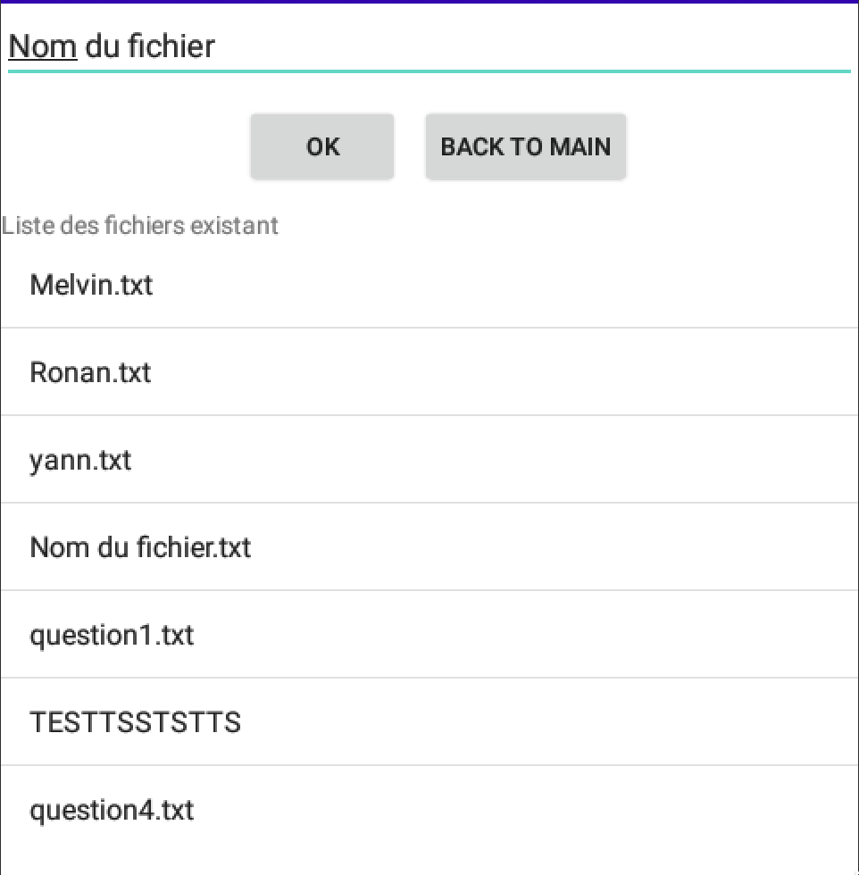
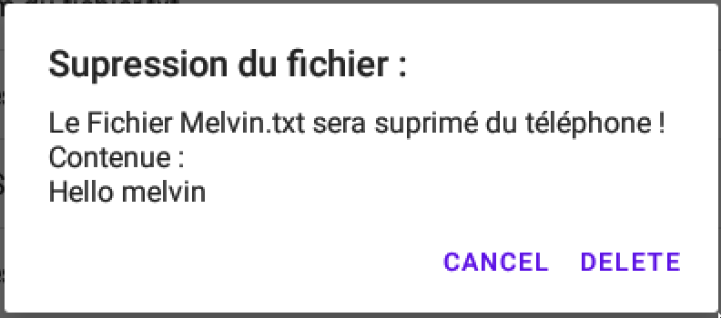
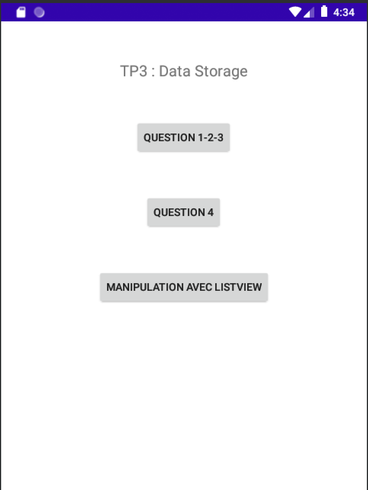
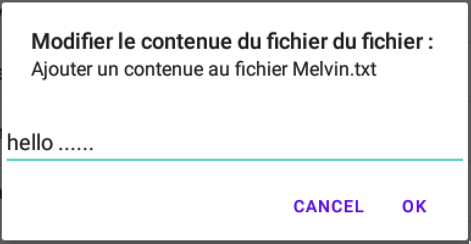

# TP3 sur le data storage
## Introduction
Durant ce tp, nous allons apprendre à manipuler les fichiers avec AndroidStudio. Le but est de pouvoir créer ainsi que de manipuler des fichiers et de les stocker dans la mémoire interne du téléphone. 
Tout au long de ce TP, nous allons utiliser l'API File fourni par Java. Cette API, nous servira afin d'effectuer diverses opérations sur les fichiers.

## Manipulation de fichier

### Création de fichier

```java
public void createCustomFile(String filenameCustom){
    File file = new File(this.getFilesDir(),filenameCustom+".txt");
    try {
        file.createNewFile();
    } catch (IOException e) {
        throw new RuntimeException(e);
    }
}
```
Pour ce qui est de la création on vient juste de créer un nouveau File. Celui-ci prenant en paramètre, l'endroit où le fichier doit être créer et comme second paramètre le nom du fichier. Enfin on appelle la méthode ```createNewFile()``` de l'API File. Afin de faciliter la programmation et d'éviter de la redondance de code, nous avons créé une méthode prenant en paramètre le nom du fichier à créer.

### Ecriture dans un fichier

```java
public void write(String message,String filename){
    try (FileOutputStream fos = openFileOutput(filename, Context.MODE_PRIVATE)) {
        fos.write(message.getBytes());
    } catch (FileNotFoundException e) {
        throw new RuntimeException(e);
    } catch (IOException e) {
        throw new RuntimeException(e);
    }
}
```
Pour ce qui est de l'écriture dans un fichier, on vient utiliser l'API ```FileOutputStream``` qui possède la méthode ```write(message)```. Cependant afin que l'écriture dans le fichier se fasse correctement, il nous faut convertir le message qui est une ```String``` en ```Bytes```à l'aide de la méthode ```getBytes()```. Comme pour la création de fichier, nous avons créé une méthode permettant d'éviter la redondance de code. Cette méthode vient prendre en paramètre le message à écrire dans le fichier et comme second paramètre le nom du fichier.

### Lecture d'un fichier et affichage dans un Layout

```java
public String showContent(String filename){
    try {
        FileInputStream fis = openFileInput(filename);
        StringBuilder sb = new StringBuilder();
        int ch;
        while ((ch = fis.read()) != -1) {
            sb.append((char) ch);
        }
        fis.close();
        return sb.toString();
    } catch (Exception e) {
        e.printStackTrace();
    }
    return "Fichier vide";
}
```
Pour ce qui est de la lecture d'un fichier, on vient utiliser l'API ```FileInputStream ``` qui possède la méthode ```openFileInput(fichier)```.
Cette méthode permet d'ouvrir le fichier qu'on lui passe en paramètre. Ensuite nous n'avons plus qu'à utiliser la méthode ```read()``` qui permet de lire le contenu du fichier. Cependant afin que la lecture du fichier se fasse correctement, il nous faut effectuer une boucle ```While()```qui va parcourir notre fichier et nous avons au préalable déclarer une ```StringBuilder``` qui va nous permettre de récupérer le contenue du fichier. Comme précédemment, nous avons créer une méthode permettant d'éviter la redondance de code. Cette méthode vient prendre en paramètre le nom du fichier.


### Récupérer la liste des fichiers d'un répertoire 
```java
public void getFiles(ListView listView){
        String[] files =  this.fileList();
        ArrayAdapter<String> adapter = new ArrayAdapter<String>(this, android.R.layout.simple_list_item_1, files);
        listView.setAdapter(adapter);
}
```
Afin d'afficher la liste des fichiers créer dans la dernière question, nous avons fait une méthode qui récupère la liste des fichiers de la mémoire interne de l'application et nous venons mettre à jour notre ListView ensuite.

### Suppression du fichier

```java
public boolean deleteFile(String fileToDelete){
    File file = new File(this.getFilesDir(),fileToDelete);
    if(file.delete()){
        return true;
    }
    return false;
}
```
Pour supprimer un fichier, nous avons fait une méthode qui permet d'éviter une redondance de code. Cette méthode prend comme paramètre le fichier à supprimer. Ensuite nous appellons la méthode ```delete()``` de l'API ```File()```.

## Manipulation de fichier avec une ListeView
Afin de manipuler l'ensemble des méthodes vu précédemment, il nous est demandé de réaliser un petit gestionnaire de fichier présent dans la mémoire interne de l'application. Pour ce faire nous avons défini notre layout, celui-ci est un LinearLayout composé de :

- EditTexte :  Il permettra de créer le fichier dont le nom sera marqué.
- LinearLayout : Ce linearlayout est là pour placer 2 boutons horizontalement
- TextView : Permet de faire la jonction entre les boutons et la liste en dessous
- ListView : Composer des fichiers qui sont dans la mémoire interne de l'application

Voici le code du Layout :
```xml
<?xml version="1.0" encoding="utf-8"?>
<LinearLayout xmlns:android="http://schemas.android.com/apk/res/android"
    android:layout_width="match_parent"
    android:layout_height="wrap_content"
    android:orientation="vertical">

    <EditText
        android:id="@+id/editText_text"
        android:layout_width="match_parent"
        android:layout_height="match_parent"
        android:text="Nom du fichier"/>

    <LinearLayout
        android:layout_width="wrap_content"
        android:layout_height="wrap_content"
        android:layout_gravity="center"
        android:orientation="horizontal">

        <Button
            android:id="@+id/button_ok"
            android:layout_width="wrap_content"
            android:layout_height="wrap_content"
            android:layout_margin="10dp"
            android:layout_gravity="center"
            android:text="OK" />

        <Button
            android:id="@+id/button_return_q7"
            android:layout_width="wrap_content"
            android:layout_height="wrap_content"
            android:layout_gravity="center"
            android:text="Back to main" />
    </LinearLayout>


    <TextView
        android:layout_width="wrap_content"
        android:layout_height="wrap_content"
        android:text="Liste des fichiers existant" />

    <ListView
        android:id="@+id/listview_file"
        android:layout_width="match_parent"
        android:layout_height="wrap_content"/>

</LinearLayout>
```
Le rendu : 


        
Pour ce qui est du code, on est d'abord venu déclarer tout nos attributs :
```java
setContentView(R.layout.layout_question5_6_7);
EditText editText = (EditText) findViewById(R.id.editText_text);
ListView listView = (ListView) findViewById(R.id.listview_file);
Button buttonOk = (Button) findViewById(R.id.button_ok);
```
Ensuite on vient établir pour chacun des attributs leurs actions associés. Cependant, avant tout cela, on vient chercher les potentiels fichiers qui n'existerait pas en appelant la méthode ```getFiles()```. 
A noter qu'à chaque fois que l'on crée ou que l'on supprime un fichier, on vient appeler la méthode ```getFiles()``` afin de mettre à jour la liste.

```java
buttonOk.setOnClickListener(new View.OnClickListener() {
    @Override
    public void onClick(View view) {
        createCustomFile(editText.getText().toString());
        getFiles(listView);
    }
});
```

Pour la suppression de fichier, nous avons décidé que lorsque l'on a un appui long sur la liste cela ouvre une boite de dialogue qui demande à l'utilisateur s'il veut oui ou non supprimer le fichier. Le simple clic est quant à lui défini pour modifier le contenu du fichier. Nous avons fait ce choix car cela permet de ne pas perdre d'espace sur notre écran. Nous sommes cependant conscient que ce n'est peut être pas intuitif pour les utilisateurs.

```java
listView.setOnItemLongClickListener(new AdapterView.OnItemLongClickListener() {
    @Override
    public boolean onItemLongClick(AdapterView<?> adapterView, View view, int i, long l) {
        String fileToDelete = getFilesName(i);
        String content = new String("Fichier vide");
        AlertDialog.Builder builder = new AlertDialog.Builder(ManageFile.this);
        builder.setTitle("Supression du fichier : ");
        content = showContent(fileToDelete);
    
        builder.setMessage("Le Fichier " + fileToDelete + " sera suprimé du téléphone !\nContenue :\n"+showContent(fileToDelete));
        builder.setPositiveButton("Delete", new DialogInterface.OnClickListener() {
            @Override
            public void onClick(DialogInterface dialog, int which) {
                deleteFile(getFilesName(i));
                getFiles(listView);
            }
        });
        builder.setNegativeButton("Cancel", null);
    
        AlertDialog dialog = builder.create();
        dialog.show();
        return true;
    }
});

listView.setOnItemClickListener(new AdapterView.OnItemClickListener() {
    @Override
    public void onItemClick(AdapterView<?> adapterView, View view, int i, long l) {
        String fileUpdate = getFilesName(i);
        AlertDialog.Builder builder = new AlertDialog.Builder(ManageFile.this);
        builder.setTitle("Modifier le contenue du fichier du fichier : ");
        builder.setMessage("Ajouter un contenue au fichier " + fileUpdate);

        final EditText editText_dialog = new EditText(ManageFile.this);
        builder.setView(editText_dialog);

        builder.setPositiveButton("OK", new DialogInterface.OnClickListener() {
            @Override
            public void onClick(DialogInterface dialog, int which) {
                String text = editText_dialog.getText().toString();
                System.out.println(text);
                write(text,fileUpdate);
            }
        });
        builder.setNegativeButton("Cancel", null);
            AlertDialog dialog = builder.create();
            dialog.show();
        }
});
```

        
## Features supplémentaire
Ayant fini en avance, nous avons développer des features supplémentaires :

- Navigation entre les différentes activités
- Modification du contenu d'un fichier

### Navigation entre les différentes activitées 
Afin que la navigabilité soit plus fluide, nous avons décidés de relier toutes les activités entre elle. Pour cela, nous avons une activité principale qui permet d'accéder aux 3 activités réalisées dans ce TP. Nous avons donc 3 classes ( 4 si on compte la classe MainActivity), afin d'y pouvoir naviguer, toutes ces classes sont déclarées comme des activitées dans le fichier ```AndroidManifest```. Ensuite nous avons déclaré des ```intent``` qui nous permet avec des boutons de naviguer entre les activités. Afin de revenir à l'activité principal, chaque activitées possède un bouton de retour qui termine l'activité.

```java
firstAct.setOnClickListener(new View.OnClickListener() {
    @Override
    public void onClick(View view) {
        Intent intent = new Intent(MainActivity.this, FirstActivity.class);
        startActivity(intent);
    }
});
```
```java
buttonBack.setOnClickListener(new View.OnClickListener() {
    @Override
    public void onClick(View view) {
        finish();
    }
});
```


### Modification du contenu d'un fichier
Comme dit précédemment, nous avons fait le choix d'attibuer le ```setOnItemLongClickListener``` de la listeview à la suppression du fichier. Cela nous laissait le ```setOnItemClickListener``` libre. Nous avons donc décidé de l'utiliser comme modificateur du contenu du ficher sélectionner.
Pour cela nous nous sommes aidé de ChatGPT, afin de savoir si il était possible de mettre une EditText dans une boite de dialogue. Après cela nous l'avons programmé comme montré ci-dessus.




## Conclusion 

Ce TP nous a permis de découvrir comment manipuler les fichiers avec Android Studio, en utilisant l'API File fourni par Java. Nous avons appris à créer, lire, écrire, copier et supprimer des fichiers, et à les stocker dans la mémoire interne du téléphone. 

Il est important de noter que la manipulation de fichiers peut être risquée, car elle peut entraîner des erreurs et des pertes de données si elle est mal gérée. Il est donc essentiel de s'assurer de comprendre les implications de chaque opération de fichier avant de l'utiliser dans votre application.


## 🙇 Author
#### Mathurin Melvin
- Github: [@Melvin](https://github.com/ghost-hikaru)
- Adresse mail : [melvin.mathurin@etudiant.univ-rennes.f](melvin.mathurin@etudiant.univ-rennes.fr)
#### Voisin Enzo
- Github: [@Enzo](https://github.com/Slonev0)
- Adresse mail : [enzo.voisin@etudiant.univ-rennes.fr](enzo.voisin@etudiant.univ-rennes.fr)
